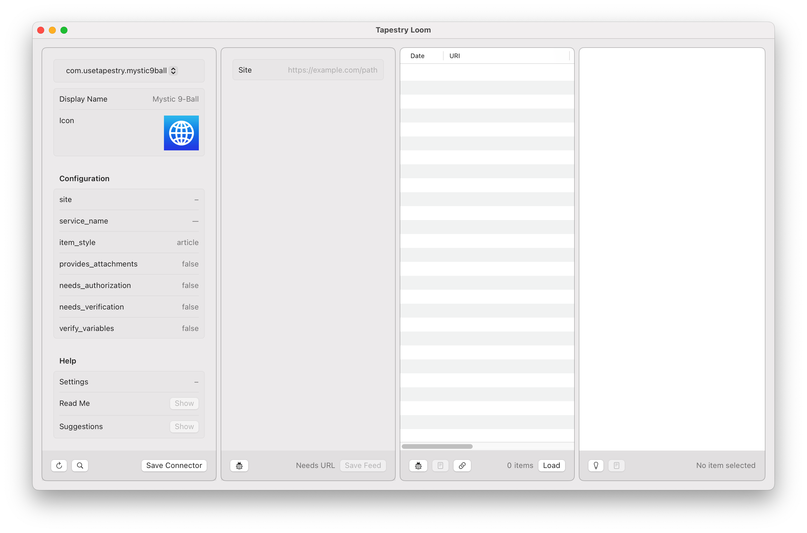
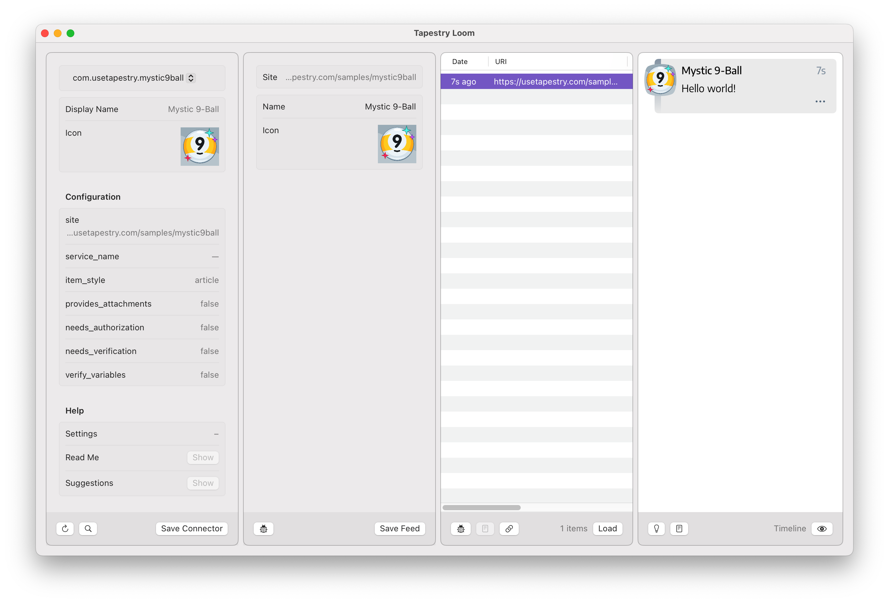
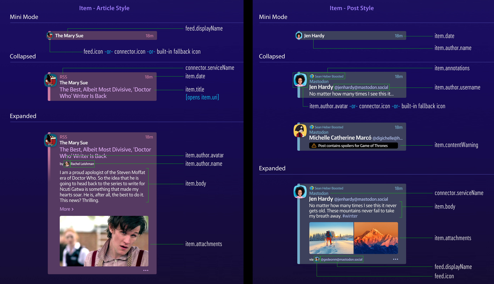

# Getting Started With the Tapestry API

## Introduction

(Intro about Mystic 9-Ball)

## Your First Connector

Create a folder on your Mac named "Connectors".

In that folder, create another folder called "com.usetapestry.mystic9ball"

(Explain RDNS)

In the "com.usetapestry.mystic9ball" folder, create the two files that are required for a connector:

  * `plugin-config.json`: contains information about the connector, for example the name that appears in Tapestry.
  * `plugin.js`: contains JavaScript that lets the connector do its work
  
The `plugin.js` file can be empty for now, but the `plugin-config.json` file requires some basic information: an `id` and `display_name` is [required](https://github.com/TheIconfactory/Tapestry/blob/main/Documentation/API.md#plugin-configjson).

```json
{
	"id": "com.usetapestry.mystic9ball",
	"display_name": "Mystic 9-Ball",
}

```

With that, your connector [appears](images/GettingStarted_1.png) in Tapestry Loom:



An important first step - your work is now showing up in the Connector (left-most) panel of the app!

## What Are You Connecting To?

A connector that doens't connect to anything isn’t very useful. Let’s fix that!

In Tapestry, a `site` specifies a location on the Internet where data can be collected. In this case, we're connecting to the Magic 9-Ball, so we’ll set it to `https://usetapestry.com/samples/mystic9ball` and have this in our `plugin-config.json`:

```json
{
	"id": "com.usetapestry.mystic9ball",
	"display_name": "Mystic 9-Ball",
	"site": "https://usetapestry.com/samples/mystic9ball",
}
```

We now need to let Loom know about the changes we've made. Click on the **↻** button in the lower-left corner of the window and you'll see `site` show up in the Connector panel. The next panel to the right, called the Feed panel, also has some information, too.

Let’s fill in some of the other configuration values to get a better icon:

```json
{
	"id": "com.usetapestry.mystic9ball",
	"display_name": "Mystic 9-Ball",
	"site": "https://usetapestry.com/samples/mystic9ball",
	"icon": "https://usetapestry.com/samples/mystic9ball/images/icon.png",
}
```

We’ll need to refresh again, but this time try using the keyboard with Cmd-R.

Our connector is now ready for the next step — feeding information to the Tapestry app.

## Feed Me!

There isn’t anything else needed to make a feed with the Mystic 9-Ball connector, so just press **Save Feed** to create a test feed.

Our focus now shifts to the third panel where results are show. The table is currently empty, but will fill in with items loaded by your connector.

Press the **Load** button and Tapestry will try to load items using your connector. You'll notice that a red dot appears next to the document icon at the bottom of the panel. When you click on this button, you'll see all the messages logged while running `plugin.js`.

But what does `EXCEPTION: ReferenceError: Can't find variable: load` mean?

This is caused by Tapestry trying to call a [load](https://github.com/TheIconfactory/Tapestry/blob/main/Documentation/API.md#load) function in the JavaScript code and failing. So let's update or `plugin.js` code to load data!

Add this to your `plugin.js`:

```javascript
function load() {
	let uri = site;
	let date = new Date();
	
	let item = Item.createWithUriDate(uri, date);
	item.body = "Hello world!";

	let items = [item];
		
	processResults(items);
}
```

You just changed the JavaScript code, so you need to refresh in the Connector panel so the code gets loaded (use the **↻** button or Cmd-R). When you press the **Load** button, the JavaScript `load()` function is called and you'll see your first item in the Results panel. And when you click on that result, you'll see it in the right-most Preview panel. Woo-hoo! 
 


So what just happened here? Let's go through it line-by-line.

An item in the timeline _must_ have two things: a URI and a date.

The URI is a [unique identifier](https://en.wikipedia.org/wiki/Uniform_Resource_Identifier) that lets Tapestry manage all the items in your timeline. The URI will usually be a URL, which is a unique place on the Internet. Tapestry presents items chronologically using the date.

To start, we'll use the unique address of the website that was defined in `plugin-config.json`. We get that information using a `site` variable that Tapestry provides to every script. Note that in some cases, such as with an RSS feed or Mastodon account, the `site` variable is specified by the end user. But no matter where it comes from, your code is guaranteed to get a string that contains a valid URL.

The `new Date()` code provides the current date and time.

Together, a JavaScript `Item` object is created using `Item.createWithUriDate(uri, date)`. Once we have that object we can add content by setting its `body` property. In this example, the content is plain text, but it can also be HTML (more about that in the next section).

The `Item` has [other properties](https://github.com/TheIconfactory/Tapestry/blob/main/Documentation/API.md#item), such as a `title`, `contentWarning`, and `attachments`.

Once the item has been created and all its properties set, it is returned as an array via `processResults`. This is the point where all the information that your connector has collected gets processed and stored by Tapestry.

Tapestry Loom uses the same processing pipeline that is used in the app, so that makes it easy for you to test and preview any changes that you make to your connector. The text editor save, Cmd-R reload, and **Load** button press is a sequence you'll repeat frequently.

## But Is It Useful?

But let's be honest: seeing "Hello World!" in your timeline every time you refresh wouldn't be very useful. Let's change that!

We know that this site has an API, but we're not exactly sure what kind of data we get from that app. But it's easy to send a request and see what we get back:

```javascript
function load() {
	let uri = site;
	let date = new Date();
	
	let item = Item.createWithUriDate(uri, date);
	item.body = "Hello world!";

	let items = [item];
	
	const endpoint = `${site}/api`;
	sendRequest(endpoint)
	.then((text) => {
		console.log(`text = ${text}`);
		processResults(items);
	})
	.catch((requestError) => {
		processError(requestError);
	});
}
```

The first thing we do is create an `endpoint` that points to the site's API. That endpoint is used with the [sendRequest](https://github.com/TheIconfactory/Tapestry/blob/main/Documentation/API.md#sendrequesturl-method-parameters-extraheaders--promise) function provided by Tapestry.

(Note: If you've used the fetch API in a browser, you’ll already power user have a good idea on how it works. The main difference is that Tapestry also securely adds Authorization headers on the request if the connector uses OAuth or JWT. If none of this makes sense to you, don't worry - it's not required to write a connector!)

After the request completes, you'll have some `text` to process. At this point we can just output it with `console.log` and return the results like before.

If the request can't complete, you should catch that `requestError` and send it back to Tapestry so it can be displayed in the user interface.

After doing Cmd-R and **Load**, you'll see the document icon update because of the log message you just added. When you press that button, you'll see something like this:

```
text = {
    "timestamp": 1722038267,
    "value": 9,
    "description": "No You Didn\u2019t",
    "image": "/samples/mystic9ball/images/ball/9ball_9.png"
}

```

Those are the results from the API and we can easily put these JSON results to use:

```javascript
function load() {
	const endpoint = `${site}/api`;
	sendRequest(endpoint)
	.then((text) => {
		const json = JSON.parse(text);

		let uri = site;
		let date = new Date(json.timestamp * 1000); // seconds → milliseconds
	
		let src = "https://usetapestry.com" + json.image; // relative → absolute url
		
		let item = Item.createWithUriDate(uri, date);
		item.body = `<p>The Mystic 9-Ball says: <b>${json.description}</b></p>`;

		let items = [item];

		processResults(items);
	})
	.catch((requestError) => {
		processError(requestError);
	});
}
```

The first thing you'll do with the text is convert it to a JSON object with `json = JSON.parse(text)`. Then `json.timestamp`, `json.description`, and `json.image` can be used to improve the item for our connector.

An important change is that the [body is HTML](https://github.com/TheIconfactory/Tapestry/blob/main/Documentation/API.md#html-content) now.

Now about that URI...

```javascript
function load() {
	const endpoint = `${site}/api`;
	sendRequest(endpoint)
	.then((text) => {
		const json = JSON.parse(text);

		let uri = site + `?value=${json.value}&timestamp=${json.timestamp}`;
		let date = new Date(json.timestamp * 1000); // seconds → milliseconds
	
		let src = "https://usetapestry.com" + json.image; // relative → absolute url
		
		let item = Item.createWithUriDate(uri, date);
		item.body = `<p>The Mystic 9-Ball says: ${json.description}</p>`;

		let items = [item];

		processResults(items);
	})
	.catch((requestError) => {
		processError(requestError);
	});
}
```

## Just How You Like it

There's a problem with our connector: it loads every time you refresh the feeds in Tapestry. You don’t need that many prognostications!

To tackle this, we'll create a variable for our JavaScript to use. This variable can be set by whoever uses the connector so everyone gets the behavior that best fits their needs.

Let's start by creating a `ui-config.json` file in our `com.usetapestry.mystic9ball` folder:

```json
{
	"inputs": [
		{
			"name": "interval",
			"type": "choices",
			"prompt": "Shake Interval (Minutes)",
			"value": "30",
			"choices": "1, 5, 15, 30, 60, 90"
		}
	]
}
```

This creates a JavaScript String variable named `interval` that contains one of the values in `choices`. The default value is "30".

Now we update our script to use the variable:

```javascript
var lastUpdate = null;

function load() {
	if (lastUpdate != null) {
		// check the interval provided by the user
		console.log(`interval = ${interval}`);
		let delta = parseInt(interval) * 60000; // minutes → milliseconds
		let future = (lastUpdate.getTime() + delta);
		let now = (new Date()).getTime();
		if (now < future) {
			// time has not elapsed, return no results
			console.log(`time until next update = ${(future - now) / 1000} sec.`);
			processResults(null);
			return;
		}
	}
	
	const endpoint = `${site}/api`;
	sendRequest(endpoint)
	.then((text) => {
		const json = JSON.parse(text);

		let uri = site + `?value=${json.value}&timestamp=${json.timestamp}`;
		let date = new Date(json.timestamp * 1000); // seconds → milliseconds
	
		let src = "https://usetapestry.com" + json.image; // relative → absolute url
		
		let item = Item.createWithUriDate(uri, date);
		item.body = `<p>The Mystic 9-Ball says: ${json.description}</p>`;

		let items = [item];

		processResults(items);
		
		lastUpdate = new Date();
	})
	.catch((requestError) => {
		processError(requestError);
	});
}
```

TODO: Settings

TODO: Explain difference between post and article (including images from Ged)



## The Fine Manual

By now, you know what this connector does. But others do not, and a little bit of README goes a long way.

Thankfully, it's an easy thing to do with your Tapestry connector. Just add a `README.md` file with Markdown syntax in your folder and you're done!

```markdown
This is a sample that shows developers how to create connectors for Tapestry.

You can find the [full tutorial on GitHub](https://github.com/TheIconfactory/Tapestry/Documentation/GettingStarted.md)

The [source code](https://github.com/TheIconfactory/Tapestry/Plugins/com.usetapestry.mystic9ball) for the connector is also available.

```

You can preview the content using the **Read Me** button in the Connector panel.


