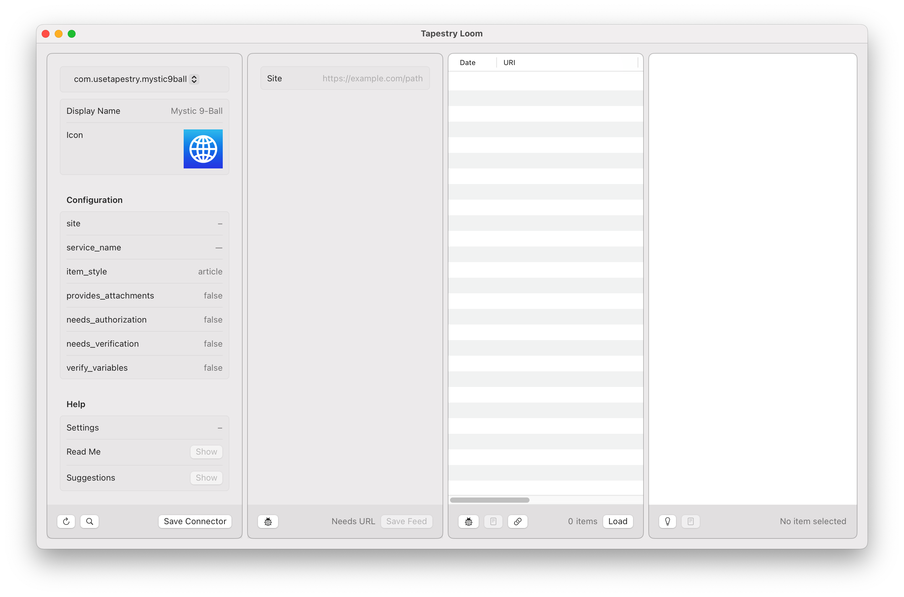

# Getting Started With the Tapestry API

## Introduction

(Intro about Mystic 9-Ball)

## Your First Connector

Create a folder on your Mac named "Connectors".

In that folder, create another folder called "com.usetapestry.mystic9ball"

(Explain RDNS)

In the "com.usetapestry.mystic9ball" folder, create the two files that are required for a connector:

  * `plugin-config.json`: contains information about the connector, for example the name that appears in Tapestry.
  * `plugin.js`: contains JavaScript that lets the connector do its work
  
The `plugin.js` file can be empty for now, but the `plugin-config.json` file requires some basic information: an `id` and `display_name` is [required](https://github.com/TheIconfactory/Tapestry/blob/main/Documentation/API.md#plugin-configjson).

```json
{
	"id": "com.usetapestry.mystic9ball",
	"display_name": "Mystic 9-Ball",
}

```

With that, your connector [appears](images/GettingStarted_1.png) in Tapestry Loom:



An important first step - your work is now showing up in the Connector (left-most) panel of the app!

## What Are You Connecting To?

A connector that doens't connect to anything isn’t very useful. Let’s fix that!

In Tapestry, a `site` specifies a location on the Internet where data can be collected. In this case, we're connecting to the Magic 9-Ball, so we’ll set it to `https://usetapestry.com/samples/mystic9ball` and have this in our `plugin-config.json`:

```json
{
	"id": "com.usetapestry.mystic9ball",
	"display_name": "Mystic 9-Ball",
	"site": "https://usetapestry.com/samples/mystic9ball",
}
```

We now need to let Loom know about the changes we've made. Click on the **↻** button in the lower-left corner of the window and you'll see `site` show up in the Connector panel. The next panel to the right, called the Feed panel, also has some information, too.

Let’s fill in some of the other configuration values to get a better icon:

```json
{
	"id": "com.usetapestry.mystic9ball",
	"display_name": "Mystic 9-Ball",
	"site": "https://usetapestry.com/samples/mystic9ball",
	"icon": "https://usetapestry.com/samples/mystic9ball/images/icon.png",
}
```

We’ll need to refresh again, but this time try using the keyboard with Cmd-R.

Our connector is now ready for the next step — feeding information to the Tapestry app.

## Feed Me!

There isn’t anything else needed to make a feed with the Mystic 9-Ball connector, so just press **Save Feed** to create a test feed.

Our focus now shifts to the third panel. The table is currently empty, but will fill in with items loaded by your connector.

Press the **Load** button and Tapestry will try to load items using your connector. You'll notice that a red dot appears next to the document icon at the bottom of the panel. When you click on this button, you'll see all the messages logged while running `plugin.js`.

But what does `EXCEPTION: ReferenceError: Can't find variable: load` mean?

This is caused by Tapestry trying to call a [load](https://github.com/TheIconfactory/Tapestry/blob/main/Documentation/API.md#load) function in the JavaScript code and failing. So let's update or `plugin.js` code to load data!

Add this to your `plugin.js`:

```javascript
function load() {
	let uri = site;
	let date = new Date();
	
	let item = Item.createWithUriDate(uri, date);
	item.body = "Hello world!";

	let items = [item];
		
	processResults(items);
}
```

TODO: explain uri (site variable) & date (order in timeline)

TODO: explain Item.createWithUriDate & body

TODO: explain processResults

Then reload your connector with Cmd-R. When you press **Load** this time, you'll see an item show up in the Items list. And you can click on the item to see it in the right-most Preview panel. Woo-hoo!

## But Is It Useful?

But let's be honest: seeing "Hello World!" in your timeline every time you refresh wouldn't be very useful. Let's change that!

We know that this site has an API, but we're not exactly sure what kind of data we get from that app. Let's send a request and see what we get back:

```javascript
function load() {
	let uri = site;
	let date = new Date();
	
	let item = Item.createWithUriDate(uri, date);
	item.body = "Hello world!";

	let items = [item];
	
	const endpoint = `${site}/api`;
	sendRequest(endpoint)
	.then((text) => {
		console.log(`text = ${text}`);
		processResults(items);
	})
	.catch((requestError) => {
		processError(requestError);
	});
}
```

TODO: explain sendRequest

TODO: explain processError

```
text = {
    "timestamp": 1722038267,
    "value": 9,
    "description": "No You Didn\u2019t",
    "image": "/samples/mystic9ball/images/ball/9ball_9.png"
}

```

Put the JSON to use:

```javascript
function load() {
	const endpoint = `${site}/api`;
	sendRequest(endpoint)
	.then((text) => {
		const json = JSON.parse(text);

		let uri = site;
		let date = new Date(json.timestamp * 1000); // seconds → milliseconds
	
		let src = "https://usetapestry.com" + json.image; // relative → absolute url
		
		let item = Item.createWithUriDate(uri, date);
		item.body = `<p>The Mystic 9-Ball says: ${json.description}</p>`;

		let items = [item];

		processResults(items);
	})
	.catch((requestError) => {
		processError(requestError);
	});
}
```

Now about that URI...

```javascript
function load() {
	const endpoint = `${site}/api`;
	sendRequest(endpoint)
	.then((text) => {
		const json = JSON.parse(text);

		let uri = site + `?value=${json.value}&timestamp=${json.timestamp}`;
		let date = new Date(json.timestamp * 1000); // seconds → milliseconds
	
		let src = "https://usetapestry.com" + json.image; // relative → absolute url
		
		let item = Item.createWithUriDate(uri, date);
		item.body = `<p>The Mystic 9-Ball says: ${json.description}</p>`;

		let items = [item];

		processResults(items);
	})
	.catch((requestError) => {
		processError(requestError);
	});
}
```

## Just How You Like it

TODO: Settings

