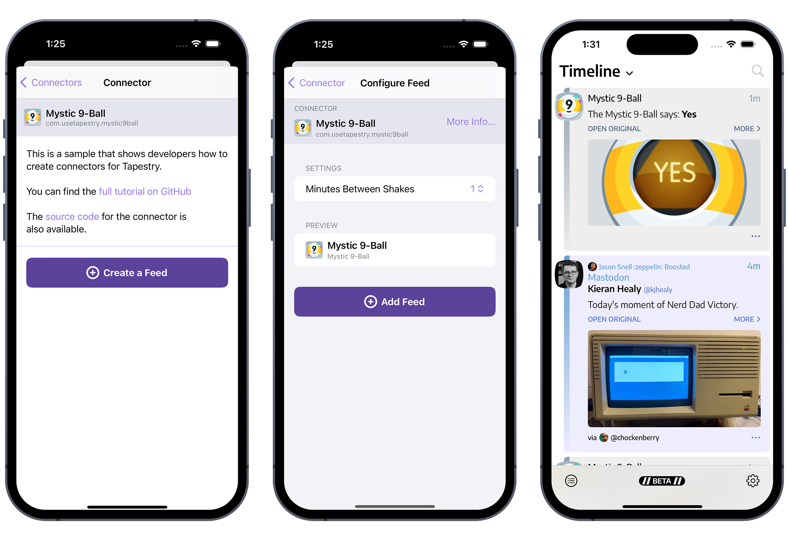

# Getting Started With the Tapestry API

## Introduction

Tapestry is an app that weaves your favorite blogs, social media, and more into a unified and chronological timeline. It does that by using connectors. Some connectors come bundled in the app: there is one for RSS, another for Mastodon, another for YouTube, etc.

But an important part of this system is that the API used to create the connectors is [completely open](https://github.com/TheIconfactory/Tapestry/blob/main/Documentation/API.md). Anyone can make a connector. And anyone can easily add a connector to Tapestry.

This tutorial will help you understand how to make a connector and contribute to the Tapestry ecosystem.


### Connectors

A connector is a collection of configuration files and code that allow a feed to gather data.

Connectors are created by folks who understand web technologies like JavaScript; feeds are created by end users who don’t need to know any of the details.

A familiar example is an RSS connector: it processes XML text with JavaScript to generate objects for a blog feed. Tapestry then takes these items and displays them chronologically in the user’s timeline.

Connectors are simple by design: everything is created with text files that you can edit with your favorite editor. As you’re developing these connectors, a tool called [Tapestry Loom](https://testflight.apple.com/join/SMcNQbCs) will help you build and test your work.

Think of this setup like creating a web page: you edit HTML and refresh your browser to see the changes. In this scenario, Tapestry Loom is the browser where you reload content.


### The Mystic 9-Ball

Think how much easier life would be if we could predict the future. Thanks to the [Mystic 9-Ball website](https://usetapestry.com/samples/mystic9ball), now we can!


These predictions help us plan our future, so wouldn’t it be great if we could put them in our Tapestry timeline?

Probably not, but it _would_ be a helpful way to show you how to build your first connector for Tapestry. At the end of this tutorial, you’ll be able to see the Mystic 9-Ball’s prognostications in your universal timeline.

Let’s get started!


## Your First Connector

Start by creating a folder on your Mac named "Connectors". It doesn’t matter where that folder is, but you may want to make it a part of a version control repository so it’s easy to track changes.

In that folder, create another folder called "com.usetapestry.mystic9ball". This is the folder where we will be collecting the text files that Tapestry uses.

Tapestry uses [reverse domain names](https://en.wikipedia.org/wiki/Reverse_domain_name_notation) to identify connectors. Every connector needs a unique identifier, and this is the simplest way to accomplish that. We use this convention for all the [built-in connectors](https://github.com/TheIconfactory/Tapestry/tree/main/Plugins).

In the "com.usetapestry.mystic9ball" folder, create the two files that are required for a connector:

  * `plugin-config.json`: information about the connector, for example the name that appears in Tapestry.
  * `plugin.js`: JavaScript that lets the connector do its work
  
The `plugin.js` file can be empty for now, but the `plugin-config.json` file requires some basic information: an `id` and `display_name` is [required](https://github.com/TheIconfactory/Tapestry/blob/main/Documentation/API.md#plugin-configjson).

```json
{
	"id": "com.usetapestry.mystic9ball",
	"display_name": "Mystic 9-Ball",
}

```

### Check It Out

At this point, you could put the connector on your device and try it out. But that means transferring it to your device, installing it in the app, and creating a test feed. And there could easily be a typo that makes you go through that process again.

That’s why we created Tapestry Loom: it lets you do all your work on a Mac and uses the same code as the mobile app to process information. It’s like a cross between the Xcode Simulator and a web browser.

Tapestry Loom is currently [available in TestFlight](https://testflight.apple.com/join/SMcNQbCs). It’s an important tool that will eventually be a free download on the Mac App Store.

The first thing you need to do is tell Loom where your "Connectors" folder is located. Use _File_ > _Select Connectors Folder…_ (or **Cmd-F**) to bring up a standard dialog and **Open** the folder you created above.


### Looming Greatness

After opening the folder, your connector appears in Tapestry Loom:


An important first step - the basic information is showing in the left-most _Connector_ panel of the app and you’re ready to start filling in the other three panels!


### What Are You Connecting To?

A connector that doesn’t connect to anything isn’t very useful. Let’s fix that!

In Tapestry, the `site` specifies a location on the Internet where data can be collected. In this case, we’re connecting to the Magic 9-Ball, so we’ll set it to `https://usetapestry.com/samples/mystic9ball` and have this in our `plugin-config.json`:

```json
{
	"id": "com.usetapestry.mystic9ball",
	"display_name": "Mystic 9-Ball",
	"site": "https://usetapestry.com/samples/mystic9ball",
}
```

We now need to let Loom know about the changes we’ve made. Click on the **↻** button in the lower-left corner of the window and you’ll see `site` show up in the _Connector_ panel. The next panel to the right, called the _Feed_ panel, also has some information.

> **Note:** There are cases where the end user needs to specify the `site` variable, for example with a Mastodon account or an RSS feed. See [the documentation](https://github.com/TheIconfactory/Tapestry/blob/main/Documentation/API.md#plugin-configjson) for more information about how this parameter is used.

Let’s fill in some of the other configuration values to get a better icon:

```json
{
	"id": "com.usetapestry.mystic9ball",
	"display_name": "Mystic 9-Ball",
	"site": "https://usetapestry.com/samples/mystic9ball",
	"icon": "https://usetapestry.com/samples/mystic9ball/images/icon.png",
}
```

We’ll need to refresh again because of these changes, but try using the **Cmd-R** keyboard shortcut this time.

Our connector is now ready for the next step — collecting information for the Tapestry app.

### Feed Me!

There isn’t anything else needed to make a feed with the Mystic 9-Ball connector, so just press **Save Feed** to create a test feed.

Our focus now shifts to the third panel where _Results_ are show. The table is currently empty, but will fill up with items loaded by your connector.

Press the **Load** button and Tapestry will try to load items using your connector. You’ll notice that a red dot appears next to the document icon at the bottom of the _Results_ panel. When you click on this button, you’ll see all the messages logged while running `plugin.js`.

But what does `EXCEPTION: ReferenceError: Can't find variable: load` mean?

This is caused by Tapestry trying to call a [load](https://github.com/TheIconfactory/Tapestry/blob/main/Documentation/API.md#load) function in your JavaScript code and failing. So let’s update or `plugin.js` code to load some data!

Add this to your `plugin.js`:

```javascript
function load() {
	let uri = site;
	let date = new Date();
	
	let item = Item.createWithUriDate(uri, date);
	item.body = "Hello world!";

	let items = [item];
		
	processResults(items);
}
```

You just changed the JavaScript code, so you need to refresh the connector and load the changes (use the **↻** button or **Cmd-R**). When you press the **Load** button, the JavaScript `load()` function is called and you’ll see your first item in the _Results_ panel. And when you click on that result, you’ll see it in the right-most _Preview_ panel. Woo-hoo! 
 


So what just happened here? Let’s go through it line-by-line.

An item in the timeline _must_ have two things: a URI and a date. The URI is a [unique identifier](https://en.wikipedia.org/wiki/Uniform_Resource_Identifier) that lets Tapestry manage all the items in your timeline. The URI will usually be a URL, which is a unique location on the Internet. The date is required to present items chronologically.

To start, we’ll use the unique address of the website that was defined in `plugin-config.json`. We get that information using a `site` variable that Tapestry provides to every script. The variable is guaranteed to be a `String` that contains a valid URL.

The `new Date()` provides the current date and time and will put the item at the beginning of the timeline.

Together, a JavaScript `Item` object is created using `Item.createWithUriDate(uri, date)`. Once we have that object we add content by setting its `body` property. In this example, the content is plain text, but it can also be HTML. The `Item` has [other properties](https://github.com/TheIconfactory/Tapestry/blob/main/Documentation/API.md#item), such as a `title`, `contentWarning`, and `attachments`. All of this will be covered in a later section.

Once the item has been created and all its properties set, it is returned as an array via `processResults`. This is the point where all the information that your connector has collected gets processed and stored by Tapestry.

Tapestry Loom uses the same processing pipeline that is used in the app, so that makes it easy for you to test and preview any changes that you make to your connector. Saving in your text editor, followed by a **Cmd-R** reload and **Load** button press is a sequence you’ll repeat frequently.

## Making Improvements

### But Is It Useful?

But let’s be honest: seeing "Hello World!" in your timeline every time you refresh wouldn’t be very useful. Let’s change that!

We know that this site has an API, but we’re not exactly sure what kind of data we get from that app. But it’s easy to send a request and see what we get back:

```javascript
function load() {
	let uri = site;
	let date = new Date();
	
	let item = Item.createWithUriDate(uri, date);
	item.body = "Hello world!";

	let items = [item];
	
	const endpoint = `${site}/api`;
	sendRequest(endpoint)
	.then((text) => {
		console.log(`text = ${text}`);
		processResults(items);
	})
	.catch((requestError) => {
		processError(requestError);
	});
}
```

The first thing we do is create an `endpoint` that points to the site’s API. That endpoint is used with the [sendRequest](https://github.com/TheIconfactory/Tapestry/blob/main/Documentation/API.md#sendrequesturl-method-parameters-extraheaders--promise) function provided by Tapestry.

> **Note:** If you’ve used the fetch API in a browser, you’re power user that already has a good idea on how this all works. The main difference with Tapestry handles all authentication on the request if the connector uses OAuth or JWT. Your script doesn’t need to worry about acquiring tokens or managing them securely: Tapestry handles all of that. If none of this makes sense to you, don’t worry - it’s not required to write a basic connector!

After the request completes, you’ll have some `text` to process. At this point we can just output it with `console.log` and return the results like before.

If the request can’t complete, you should catch that `requestError` and send it back to Tapestry so it can be displayed in the user interface.

After doing **Cmd-R** and **Load**, you’ll see the document icon update because of the log message you just added. When you press that button, you’ll see something like this:

```
text = {
    "timestamp": 1722038267,
    "value": 9,
    "description": "No You Didn\u2019t",
    "image": "/samples/mystic9ball/images/ball/9ball_9.png"
}
```

Those are the results from the API and we can easily put these JSON results to use:

```javascript
function load() {
	const endpoint = `${site}/api`;
	sendRequest(endpoint)
	.then((text) => {
		const json = JSON.parse(text);

		let uri = site;
		let date = new Date(json.timestamp * 1000); // seconds → milliseconds
	
		let src = "https://usetapestry.com" + json.image; // relative → absolute url
		
		let item = Item.createWithUriDate(uri, date);
		item.body = `<p>The Mystic 9-Ball says: <b>${json.description}</b></p>`;

		let items = [item];

		processResults(items);
	})
	.catch((requestError) => {
		processError(requestError);
	});
}
```

The first thing you’ll do with the text is convert it to a JSON object with `json = JSON.parse(text)`. Then `json.timestamp`, `json.description`, and `json.image` can be used to improve the item for our connector.

Also note that the item’s body is now specified using HTML. Even if you’re familiar with this markup, you should check out [how Tapestry uses  HTML](https://github.com/TheIconfactory/Tapestry/blob/main/Documentation/API.md#html-content). 

One issue with the script above is that the URI never changes; only the date gets updated. Tapestry will detect this and constantly put the item at the top of the timeline. From a user’s point-of-view, it’s better to make sure that each URI produced is unique and keeps it’s place in the universal timeline.

Luckily, we can easily do this using information in the JSON data:

```javascript
		let uri = site + `?value=${json.value}&timestamp=${json.timestamp}`;
```

By adding both the `json.value` and `json.timestamp` as query parameters, a unique URL is formed. An added benefit is that this URL can now be shared by folks that are using your connector. If they get a [“Nailed It”](https://usetapestry.com/samples/mystic9ball/?value=3&timestamp=1722038267), all their friends can see it!


### Just How You Like it

There’s another problem with our connector: it loads every time you refresh the feeds in Tapestry. We don’t need that many prognostications!

To tackle this issue, we’ll create a variable for our JavaScript to use. This variable can be set by whoever uses the connector to get the behavior that best fits their needs.

Let’s start by creating a `ui-config.json` file in our `com.usetapestry.mystic9ball` folder:

```json
{
	"inputs": [
		{
			"name": "interval",
			"type": "choices",
			"prompt": "Minutes Between Shakes",
			"value": "30",
			"choices": "1, 5, 15, 30, 60, 90"
		}
	]
}
```

This creates a JavaScript String variable named `interval` that contains one of the values in `choices`. The default value is “30” minutes, but a time range from 1 to 90 minutes is available.

This new variable is added to the script:

```javascript
var lastUpdate = null;

function load() {
	if (lastUpdate != null) {
		// check the interval provided by the user
		console.log(`interval = ${interval}`);
		let delta = parseInt(interval) * 60000; // minutes → milliseconds
		let future = (lastUpdate.getTime() + delta);
		let now = (new Date()).getTime();
		if (now < future) {
			// time has not elapsed, return no results
			console.log(`time until next update = ${(future - now) / 1000} sec.`);
			processResults(null);
			return;
		}
	}
	
	const endpoint = `${site}/api`;
	sendRequest(endpoint)
	.then((text) => {
		const json = JSON.parse(text);

		let uri = site + `?value=${json.value}&timestamp=${json.timestamp}`;
		let date = new Date(json.timestamp * 1000); // seconds → milliseconds
	
		let src = "https://usetapestry.com" + json.image; // relative → absolute url
		
		let item = Item.createWithUriDate(uri, date);
		item.body = `<p>The Mystic 9-Ball says: ${json.description}</p>`;

		let items = [item];

		processResults(items);
		
		lastUpdate = new Date();
	})
	.catch((requestError) => {
		processError(requestError);
	});
}
```

Reload the connector and the _Feed_ panel will show the new _Minutes Between Shakes_ setting with your list of choices. Try setting it to “1” and then **Save Feed**.

Now, the **Load** button will only update the _Results_ list if a minute has passed. The button to show the `console.log()` output lets you verify that everything is working correctly.


### The Fine Manual

By now, you know what this connector does. But others do not, and a little bit of README goes a long way.

Thankfully, it’s an easy thing to do with your Tapestry connector. Just add a `README.md` file with Markdown syntax in your folder and you’re done!

```markdown
This is a sample that shows developers how to create connectors for Tapestry.

You can find the [full tutorial on GitHub](https://github.com/TheIconfactory/Tapestry/Documentation/GettingStarted.md)

The [source code](https://github.com/TheIconfactory/Tapestry/Plugins/com.usetapestry.mystic9ball) for the connector is also available.

```

You can preview the content using the **Read Me** button in the _Connector_ panel.


Another way to help folks use your connector is by providing suggestions. There isn’t anything to suggest for the Mystic 9-Ball, but you can learn more about the `suggestions.json` file in [the documentation](https://github.com/TheIconfactory/Tapestry/blob/documentation-update/Documentation/API.md#suggestionsjson).

### Finding Yourself

Tapestry’s _Feed Finder_ is a powerful way for people to find your connector: all they need to know is a URL. With that information, the app can check for connectors that can be used on the site.

> **Note:** Eventually, this functionality will be available as an extension, so folks can find feeds directly from the web browser.

This feature works by using a `discovery.json` file in your connector folder. Create one with this information:

```json
{
	"sites": [
		"usetapestry.com"
	]
}
```

After reloading the connector, the magnifying glass icon in the lower-left of the _Connector_ panel opens a sheet where you can test the Feed Finder. Any URL on `usetapestry.com` will now suggest our connector. Cool!


This is a simple example: there are cases where the contents of the page need to be examined and extracted. This is covered in [the documentation](https://github.com/TheIconfactory/Tapestry/blob/main/Documentation/API.md#discoveryjson).


## Portable Predictions

The connector is in a good state now and we want to see it on a mobile device. It’s easy to do using Tapestry Loom: just press the **Save Connector** button in the _Connector_ panel (or use **Cmd-S**).

You’ll want to save the place in a location that’s accessible by your iPhone: iCloud Drive is a great choice because it also makes sharing a link to the file easy.

For this example, let’s use the name “Mystic9Ball.tapestry”.

Now on your device, you can open the Tapestry app and navigate to _Settings_ > _Connectors_ > _Add a Connector_ and select the “Mystic9Ball.tapestry” you just saved. After that, you’ll see “Mystic 9-Ball” and “com.usetapestry.mystic9ball” in the list of connectors. If you want to remove it for any reason, use _Remove Connectors_.

If you tap the connector in the list, you’ll see its README and a _Create a Feed_ button. After entering the settings and tapping _Add Feed_, predictions will start appearing in your timeline.

Yes, indeed!  



> NOTE: In the current beta, there are cases where changes to the connectors or feeds are not recognized because of caching. If something is not updating correctly, force quit the app and try again.


## The Power of Items

You’re done making a connector, but this tutorial has taken the simplest path through the API. In this section, we’ll look at different ways to present the information your connector collects.

### Stylish Items

We’ve design the `Item` to be flexible and usable for many different needs. One of the first things you’ll need to consider is whether you want an “article” or “post” presentation. The article style, which is the default, places the emphasis on the source and title of the content. The post style places the emphasis on the creator of the content.

Information feeds, such as RSS, benefit from the article style. Social network feeds, such as Mastodon, benefit from the post style.


The style is defined in `plugin-config.json`: add an `item_style` property with a `post` or `article` value.

```json
{
	"id": "com.usetapestry.mystic9ball",
	"display_name": "Mystic 9-Ball",
	"site": "https://usetapestry.com/samples/mystic9ball",
	"icon": "https://usetapestry.com/samples/mystic9ball/images/icon.png",
	"item_style": "post",
}

```

### Props to You

Once you’ve chosen a style to use, you’ll want to fill in as many of the `Item` properties as possible. For example, it’s easy to add a title:

```javascript
		item.title = "Shake it Up!";
```

If an article or post has an author, you create an `Identity` and assign it to the item’s `author` property:

```javascript
		let identity = Identity.createWithName("Mister Mystic");
		identity.uri = "https://usetapestry.com/samples/mystic9ball";
		identity.username = "@HighRoller";
		identity.avatar = "https://usetapestry.com/samples/mystic9ball/images/9ball.png";
		
		item.author = identity;
```

Note how the author information is displayed very differently between the article and post styles.

Annotations can be used to indicate the source of an item. For example, the account that boosted an item from a social network. Here’s a contrived example:

```javascript
		let annotation = Annotation.createWithText("The Iconfactory created");
		annotation.icon = "https://iconfactory.com/favicon.ico";
		annotation.uri = "https://iconfactory.com";
		item.annotations = [annotation];
```

Properties of an `Item` are easy to verify. When you click on the document icon at the bottom of the _Preview_ panel, this view is presented:


### Getting Attached

In the examples above, the HTML markup provided the image for the item. By default, Tapestry looks for images and other media as it processes the `body` HTML and generates media attachments automatically (there is an internal `extractedAutomatically` property that indicates if this happened: it can be seen in the screenshot above).

When you are working with an API that provides media explicitly, it's easier to create the attachments in your script. If you choose this path, you’ll need to set `provides_attachments` to true in the `plugin-config.json` file:

```json
{
	"id": "com.usetapestry.mystic9ball",
	"display_name": "Mystic 9-Ball",
	"site": "https://usetapestry.com/samples/mystic9ball",
	"icon": "https://usetapestry.com/samples/mystic9ball/images/icon.png",
	"item_style": "article",
	"provides_attachments": true,
}
```

To create the `MediaAttachment`, you instantiate it with a source URL and set [the properties](https://github.com/TheIconfactory/Tapestry/blob/main/Documentation/API.md#mediaattachment):

```javascript
		let mediaAttachment = MediaAttachment.createWithUrl(src);
		mediaAttachment.aspectSize = {width : 500, height: 500};
		mediaAttachment.text = `Mystic 9-Ball saying ${json.description}`;
		
		item.attachments = [mediaAttachment];
```

There is no limit to the number of attachments, but only the first four are displayed as thumbnails in the user’s timeline. Also note that adding `text` will allow Tapestry to make the image accessible with VoiceOver.

The `LinkAttachment` works similarly and allows Tapestry to display a preview card using its [properties](https://github.com/TheIconfactory/Tapestry/blob/main/Documentation/API.md#linkattachment).

```javascript
		let linkAttachment = LinkAttachment.createWithUrl(uri);
		linkAttachment.type = "website";
		linkAttachment.title = "Shake It Up With The Mystic 9-Ball!";
		linkAttachment.subtitle = "Get fun answers to life’s toughest questions with the Mystic 9-Ball & its cryptic prognostications.";
		linkAttachment.image = "https://usetapestry.com/samples/mystic9ball/images/banner.png";
		linkAttachment.aspectSize = {width : 1024, height: 768};

		item.attachments = [linkAttachment];
```

Only the first link attachment will be used by Tapestry. Also, if you only set the URL, Tapestry will fill in the other properties automatically using any [Open Graph](https://ogp.me) information on the web page.

Note that `MediaAttachment` is shown in both the timeline and detail views, while the `LinkAttachment` is only shown in the timeline.

Generally, it’s not a good idea to show media and link attachments at the same time: it's just too much information for a user to parse quickly and carries a risk of duplicated information.


## One More Thing

Before we finish up with this tutorial, we’re going to quickly cover a few advanced topics.

### Verification

In the sample connector, you created a `load()` function that's called when generating items. Tapestry can also call another function named `verify()`. This function serves as a way to provide Tapestry with [information that's specific to the feed](https://github.com/TheIconfactory/Tapestry/blob/main/Documentation/API.md#verify).

If a feed that’s using your connector needs a specific name (such as a blog name) or an icon (like an avatar), you’ll want to add `needs_verification` to `plugin-config.json` and implement the `verify()` function in `plugin.js`.

You may also find that the `lookupIcon()` function is useful for [getting the icon](https://github.com/TheIconfactory/Tapestry/blob/main/Documentation/API.md#lookupiconurl--promise) associated with a URL.
 
The [JSON Feed connector](https://github.com/TheIconfactory/Tapestry/blob/main/Plugins/org.jsonfeed/plugin.js) is a good example of how verification can be implemented.

 
### Web Inspector

While working on the sample connector, we used `console.log()` to generate debugging output. But when you’re dealing with something like an unexpected null value in a JSON payload, it’s a lot easier to be able to step through code line-by-line and check variables.

Luckily, Tapestry Loom integrates with Safari’s Web Inspector with minimal setup.

First, you'll want to go into Safari’s _Develop_ menu, find your Mac in the list, and put a checkmark next to **Automatically Show Web Inspector for JSContexts** and **Automatically Pause Connecting to JSContexts**. Safari will remember these settings, so this is typically a one-time setup.

After Safari is configured, you can then start using the ladybug icons at the bottom of the _Feed_ and _Results_ panels. When these buttons are highlighted, the Web Inspector will be opened before `verify()` and `load()` are called. This lets you set breakpoints in your script, see variables, and step through code.


## Conclusion

Hopefully this has been an enjoyable excursion through the Tapestry API and inspires you to make connectors of your own.


